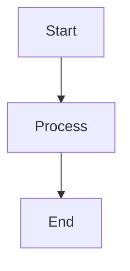
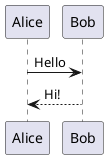

# Mermaid & PlantUML Diagram Rendering Implementation Plan

> **For agentic workers:** REQUIRED SUB-SKILL: Use superpowers:subagent-driven-development (recommended) or superpowers:executing-plans to implement this plan task-by-task. Steps use checkbox (`- [ ]`) syntax for tracking.

**Goal:** Add client-side rendering support for Mermaid and PlantUML diagrams in Markdown files with lazy loading, theme adaptation, and error handling.

**Architecture:** Independent rendering libraries - Mermaid uses mermaid.js for local rendering, PlantUML uses plantuml-encoder + PlantUML server. Lazy loading via Intersection Observer. Diagrams are detected in Markdown code blocks and rendered as SVG.

**Tech Stack:** mermaid.js ^11.0.0, plantuml-encoder ^1.4.0, Intersection Observer API, solid-js

---

## File Structure

**新增文件：**
- `frontend/src/services/diagramService.ts` - 统一图表渲染服务接口
- `frontend/src/services/mermaidService.ts` - Mermaid 渲染实现
- `frontend/src/services/plantumlService.ts` - PlantUML 渲染实现
- `frontend/src/components/DiagramPlaceholder.tsx` - 图表占位符组件（懒加载）
- `frontend/src/test/services/diagramService.test.ts` - diagramService 单元测试
- `frontend/src/test/services/mermaidService.test.ts` - mermaidService 单元测试
- `frontend/src/test/services/plantumlService.test.ts` - plantumlService 单元测试
- `frontend/src/test/components/DiagramPlaceholder.test.tsx` - DiagramPlaceholder 单元测试
- `frontend/src/test/utils/markdownWithDiagram.test.ts` - Markdown 图表集成测试

**修改文件：**
- `frontend/package.json` - 添加 mermaid 和 plantuml-encoder 依赖
- `frontend/src/components/MarkdownView.tsx` - 修改 code renderer 支持图表代码块
- `frontend/src/utils/markdown.ts` - 新增图表相关辅助函数

---

## Task 1: Install Dependencies

**Files:**
- Modify: `frontend/package.json`

- [ ] **Step 1: Add mermaid and plantuml-encoder dependencies**

Open `frontend/package.json` and add to dependencies section:

```json
"dependencies": {
  "@codemirror/commands": "^6.8.0",
  "@codemirror/lang-html": "^6.4.11",
  "@codemirror/lang-markdown": "^6.3.1",
  "@codemirror/language-data": "^6.5.1",
  "@codemirror/search": "^6.6.0",
  "@codemirror/state": "^6.5.0",
  "@codemirror/theme-one-dark": "^6.1.2",
  "@codemirror/view": "^6.36.2",
  "@pierre/diffs": "^1.1.0",
  "@pierre/theme": "^0.0.24",
  "@pierre/trees": "^1.0.0-beta.3",
  "@shikijs/transformers": "^1.0.0",
  "codemirror": "^6.0.1",
  "dompurify": "^3.4.5",
  "marked": "^15.0.0",
  "marked-shiki": "^1.2.1",
  "mermaid": "^11.0.0",
  "plantuml-encoder": "^1.4.0",
  "shiki": "^1.0.0",
  "solid-js": "^1.9.11"
}
```

- [ ] **Step 2: Install dependencies**

Run: `cd frontend && npm install`

Expected: Dependencies installed successfully

- [ ] **Step 3: Verify installation**

Run: `cd frontend && npm list mermaid plantuml-encoder`

Expected: Both packages listed with version numbers

- [ ] **Step 4: Commit**

```bash
git add frontend/package.json frontend/package-lock.json
git commit -m "chore: add mermaid and plantuml-encoder dependencies"
```

---

## Task 2: Create Diagram Service Interface

**Files:**
- Create: `frontend/src/services/diagramService.ts`
- Test: `frontend/src/test/services/diagramService.test.ts`

- [ ] **Step 1: Write the failing test for diagramService**

Create `frontend/src/test/services/diagramService.test.ts`:

```typescript
import { describe, it, expect, vi } from 'vitest';
import { renderDiagram, isDiagramLanguage } from '../../services/diagramService';

describe('diagramService', () => {
  describe('isDiagramLanguage', () => {
    it('should return true for mermaid', () => {
      expect(isDiagramLanguage('mermaid')).toBe(true);
    });

    it('should return true for plantuml', () => {
      expect(isDiagramLanguage('plantuml')).toBe(true);
    });

    it('should return false for other languages', () => {
      expect(isDiagramLanguage('javascript')).toBe(false);
      expect(isDiagramLanguage('python')).toBe(false);
      expect(isDiagramLanguage('')).toBe(false);
    });
  });

  describe('renderDiagram', () => {
    it('should throw error for unsupported diagram type', async () => {
      await expect(renderDiagram('unsupported', 'code', 'light'))
        .rejects.toThrow('Unsupported diagram type');
    });
  });
});
```

- [ ] **Step 2: Run test to verify it fails**

Run: `cd frontend && npm test src/test/services/diagramService.test.ts`

Expected: FAIL with "Cannot find module '../../services/diagramService'"

- [ ] **Step 3: Write minimal implementation**

Create `frontend/src/services/diagramService.ts`:

```typescript
export interface DiagramRenderer {
  render(code: string, theme: 'light' | 'dark'): Promise<string>;
}

export const SUPPORTED_DIAGRAM_TYPES = ['mermaid', 'plantuml'] as const;
export type DiagramType = typeof SUPPORTED_DIAGRAM_TYPES[number];

export function isDiagramLanguage(lang: string): boolean {
  return SUPPORTED_DIAGRAM_TYPES.includes(lang as DiagramType);
}

export async function renderDiagram(
  type: DiagramType,
  code: string,
  theme: 'light' | 'dark'
): Promise<string> {
  if (!isDiagramLanguage(type)) {
    throw new Error(`Unsupported diagram type: ${type}`);
  }
  
  return '';
}
```

- [ ] **Step 4: Run test to verify it passes**

Run: `cd frontend && npm test src/test/services/diagramService.test.ts`

Expected: PASS (2 tests passing)

- [ ] **Step 5: Commit**

```bash
git add frontend/src/services/diagramService.ts frontend/src/test/services/diagramService.test.ts
git commit -m "feat: create diagram service interface"
```

---

## Task 3: Implement Mermaid Renderer

**Files:**
- Create: `frontend/src/services/mermaidService.ts`
- Test: `frontend/src/test/services/mermaidService.test.ts`

- [ ] **Step 1: Write the failing test for mermaidService**

Create `frontend/src/test/services/mermaidService.test.ts`:

```typescript
import { describe, it, expect, beforeEach, vi } from 'vitest';
import { MermaidRenderer } from '../../services/mermaidService';

describe('MermaidRenderer', () => {
  let renderer: MermaidRenderer;

  beforeEach(() => {
    renderer = new MermaidRenderer();
  });

  describe('render', () => {
    it('should render simple flowchart', async () => {
      const code = 'graph TD\nA-->B';
      const result = await renderer.render(code, 'light');
      expect(result).toContain('<svg');
      expect(result).toContain('graph TD');
    });

    it('should render with dark theme', async () => {
      const code = 'graph TD\nA-->B';
      const result = await renderer.render(code, 'dark');
      expect(result).toContain('<svg');
    });

    it('should return error for invalid syntax', async () => {
      const invalidCode = 'invalid mermaid code';
      const result = await renderer.render(invalidCode, 'light');
      expect(result).toContain('Mermaid 渲染失败');
    });

    it('should return error for empty code', async () => {
      const result = await renderer.render('', 'light');
      expect(result).toContain('Mermaid 渲染失败');
    });
  });
});
```

- [ ] **Step 2: Run test to verify it fails**

Run: `cd frontend && npm test src/test/services/mermaidService.test.ts`

Expected: FAIL with "Cannot find module '../../services/mermaidService'"

- [ ] **Step 3: Write minimal implementation**

Create `frontend/src/services/mermaidService.ts`:

```typescript
import mermaid from 'mermaid';
import type { DiagramRenderer } from './diagramService';
import { escapeHtml } from '../utils/html';

export class MermaidRenderer implements DiagramRenderer {
  private initialized = false;

  private initialize(theme: 'light' | 'dark'): void {
    if (!this.initialized) {
      mermaid.initialize({
        startOnLoad: false,
        theme: theme === 'dark' ? 'dark' : 'default',
        securityLevel: 'loose',
        flowchart: {
          useMaxWidth: true,
          htmlLabels: true,
        },
        sequence: {
          useMaxWidth: true,
        },
      });
      this.initialized = true;
    }
  }

  async render(code: string, theme: 'light' | 'dark'): Promise<string> {
    if (!code || code.trim() === '') {
      return this.createErrorTemplate('Mermaid 渲染失败', '图表代码为空', code);
    }

    try {
      this.initialize(theme);
      
      const id = `mermaid-${Date.now()}-${Math.random().toString(36).substr(2, 9)}`;
      const { svg } = await mermaid.render(id, code);
      
      return svg;
    } catch (error) {
      const errorMessage = error instanceof Error ? error.message : '未知错误';
      return this.createErrorTemplate('Mermaid 渲染失败', errorMessage, code);
    }
  }

  private createErrorTemplate(title: string, message: string, code: string): string {
    return `
      <div class="diagram-error">
        <div class="error-title">${title}</div>
        <div class="error-message">${escapeHtml(message)}</div>
        <pre class="error-code">${escapeHtml(code)}</pre>
      </div>
    `;
  }
}
```

- [ ] **Step 4: Run test to verify it passes**

Run: `cd frontend && npm test src/test/services/mermaidService.test.ts`

Expected: PASS (4 tests passing)

- [ ] **Step 5: Commit**

```bash
git add frontend/src/services/mermaidService.ts frontend/src/test/services/mermaidService.test.ts
git commit -m "feat: implement Mermaid renderer with error handling"
```

---

## Task 4: Implement PlantUML Renderer

**Files:**
- Create: `frontend/src/services/plantumlService.ts`
- Test: `frontend/src/test/services/plantumlService.test.ts`

- [ ] **Step 1: Write the failing test for plantumlService**

Create `frontend/src/test/services/plantumlService.test.ts`:

```typescript
import { describe, it, expect, beforeEach, vi } from 'vitest';
import { PlantUMLRenderer } from '../../services/plantumlService';

// Mock fetch for testing
global.fetch = vi.fn();

describe('PlantUMLRenderer', () => {
  let renderer: PlantUMLRenderer;

  beforeEach(() => {
    renderer = new PlantUMLRenderer();
    vi.clearAllMocks();
  });

  describe('encodePlantUML', () => {
    it('should encode PlantUML code correctly', () => {
      const code = '@startuml\nA -> B\n@enduml';
      const encoded = renderer.encodePlantUML(code);
      expect(encoded).toBeTruthy();
      expect(encoded.length).toBeGreaterThan(0);
    });
  });

  describe('render', () => {
    it('should return error for missing @startuml/@enduml', async () => {
      const invalidCode = 'A -> B';
      const result = await renderer.render(invalidCode, 'light');
      expect(result).toContain('PlantUML 语法错误');
    });

    it('should return error for empty code', async () => {
      const result = await renderer.render('', 'light');
      expect(result).toContain('PlantUML 渲染失败');
    });

    it('should fetch SVG from PlantUML server', async () => {
      const mockSvg = '<svg>test</svg>';
      (global.fetch as any).mockResolvedValueOnce({
        ok: true,
        text: () => Promise.resolve(mockSvg),
      });

      const code = '@startuml\nA -> B\n@enduml';
      const result = await renderer.render(code, 'light');
      expect(result).toBe(mockSvg);
    });

    it('should handle network error', async () => {
      (global.fetch as any).mockRejectedValueOnce(new Error('Network error'));

      const code = '@startuml\nA -> B\n@enduml';
      const result = await renderer.render(code, 'light');
      expect(result).toContain('PlantUML 服务器连接失败');
    });
  });
});
```

- [ ] **Step 2: Run test to verify it fails**

Run: `cd frontend && npm test src/test/services/plantumlService.test.ts`

Expected: FAIL with "Cannot find module '../../services/plantumlService'"

- [ ] **Step 3: Write minimal implementation**

Create `frontend/src/services/plantumlService.ts`:

```typescript
import plantumlEncoder from 'plantuml-encoder';
import type { DiagramRenderer } from './diagramService';
import { escapeHtml } from '../utils/html';

const PLANTUML_SERVER = 'https://www.plantuml.com/plantuml/svg/';

export class PlantUMLRenderer implements DiagramRenderer {
  encodePlantUML(code: string): string {
    return plantumlEncoder.encode(code);
  }

  async render(code: string, theme: 'light' | 'dark'): Promise<string> {
    if (!code || code.trim() === '') {
      return this.createErrorTemplate('PlantUML 渲染失败', '图表代码为空', code);
    }

    if (!code.includes('@startuml') || !code.includes('@enduml')) {
      return this.createErrorTemplate(
        'PlantUML 语法错误',
        '缺少 @startuml 或 @enduml 标记',
        code
      );
    }

    try {
      const encoded = this.encodePlantUML(code);
      const url = `${PLANTUML_SERVER}${encoded}`;
      
      const response = await fetch(url);
      
      if (!response.ok) {
        return this.createNetworkErrorTemplate();
      }

      const svg = await response.text();

      if (svg.includes('SyntaxError?')) {
        const errorMessage = this.extractPlantUMLError(svg);
        return this.createErrorTemplate('PlantUML 语法错误', errorMessage, code);
      }

      return svg;
    } catch (error) {
      if (error instanceof TypeError && error.message.includes('fetch')) {
        return this.createNetworkErrorTemplate();
      }
      const errorMessage = error instanceof Error ? error.message : '未知错误';
      return this.createErrorTemplate('PlantUML 渲染失败', errorMessage, code);
    }
  }

  private extractPlantUMLError(svg: string): string {
    const errorMatch = svg.match(/SyntaxError\?(.*)/);
    return errorMatch ? errorMatch[1] : '语法错误';
  }

  private createErrorTemplate(title: string, message: string, code: string): string {
    return `
      <div class="diagram-error">
        <div class="error-title">${title}</div>
        <div class="error-message">${escapeHtml(message)}</div>
        <pre class="error-code">${escapeHtml(code)}</pre>
      </div>
    `;
  }

  private createNetworkErrorTemplate(): string {
    return `
      <div class="diagram-error">
        <div class="error-title">PlantUML 服务器连接失败</div>
        <div class="error-message">请检查网络连接或稍后重试</div>
        <div class="error-hint">
          你可以访问 <a href="https://plantuml.com" target="_blank">plantuml.com</a> 确认服务可用性
        </div>
      </div>
    `;
  }
}
```

- [ ] **Step 4: Run test to verify it passes**

Run: `cd frontend && npm test src/test/services/plantumlService.test.ts`

Expected: PASS (5 tests passing)

- [ ] **Step 5: Commit**

```bash
git add frontend/src/services/plantumlService.ts frontend/src/test/services/plantumlService.test.ts
git commit -m "feat: implement PlantUML renderer with network error handling"
```

---

## Task 5: Integrate Renderers into DiagramService

**Files:**
- Modify: `frontend/src/services/diagramService.ts`
- Modify: `frontend/src/test/services/diagramService.test.ts`

- [ ] **Step 1: Write failing test for renderDiagram integration**

Update `frontend/src/test/services/diagramService.test.ts`:

```typescript
import { describe, it, expect, vi } from 'vitest';
import { renderDiagram, isDiagramLanguage } from '../../services/diagramService';

// Mock fetch for PlantUML
global.fetch = vi.fn();

describe('diagramService', () => {
  describe('isDiagramLanguage', () => {
    it('should return true for mermaid', () => {
      expect(isDiagramLanguage('mermaid')).toBe(true);
    });

    it('should return true for plantuml', () => {
      expect(isDiagramLanguage('plantuml')).toBe(true);
    });

    it('should return false for other languages', () => {
      expect(isDiagramLanguage('javascript')).toBe(false);
      expect(isDiagramLanguage('python')).toBe(false);
      expect(isDiagramLanguage('')).toBe(false);
    });
  });

  describe('renderDiagram', () => {
    it('should render mermaid diagram', async () => {
      const code = 'graph TD\nA-->B';
      const result = await renderDiagram('mermaid', code, 'light');
      expect(result).toContain('<svg');
    });

    it('should render plantuml diagram', async () => {
      const mockSvg = '<svg>test</svg>';
      (global.fetch as any).mockResolvedValueOnce({
        ok: true,
        text: () => Promise.resolve(mockSvg),
      });

      const code = '@startuml\nA -> B\n@enduml';
      const result = await renderDiagram('plantuml', code, 'light');
      expect(result).toContain('<svg');
    });

    it('should throw error for unsupported diagram type', async () => {
      await expect(renderDiagram('unsupported' as any, 'code', 'light'))
        .rejects.toThrow('Unsupported diagram type');
    });
  });
});
```

- [ ] **Step 2: Run test to verify it fails**

Run: `cd frontend && npm test src/test/services/diagramService.test.ts`

Expected: FAIL with "renderDiagram returns empty string"

- [ ] **Step 3: Implement renderDiagram integration**

Update `frontend/src/services/diagramService.ts`:

```typescript
import { MermaidRenderer } from './mermaidService';
import { PlantUMLRenderer } from './plantumlService';
import type { DiagramRenderer } from './diagramService';

export interface DiagramRenderer {
  render(code: string, theme: 'light' | 'dark'): Promise<string>;
}

export const SUPPORTED_DIAGRAM_TYPES = ['mermaid', 'plantuml'] as const;
export type DiagramType = typeof SUPPORTED_DIAGRAM_TYPES[number];

const renderers: Record<DiagramType, DiagramRenderer> = {
  mermaid: new MermaidRenderer(),
  plantuml: new PlantUMLRenderer(),
};

export function isDiagramLanguage(lang: string): boolean {
  return SUPPORTED_DIAGRAM_TYPES.includes(lang as DiagramType);
}

export async function renderDiagram(
  type: DiagramType,
  code: string,
  theme: 'light' | 'dark'
): Promise<string> {
  if (!isDiagramLanguage(type)) {
    throw new Error(`Unsupported diagram type: ${type}`);
  }

  const renderer = renderers[type];
  return await renderer.render(code, theme);
}

export { MermaidRenderer, PlantUMLRenderer };
```

- [ ] **Step 4: Run test to verify it passes**

Run: `cd frontend && npm test src/test/services/diagramService.test.ts`

Expected: PASS (5 tests passing)

- [ ] **Step 5: Commit**

```bash
git add frontend/src/services/diagramService.ts frontend/src/test/services/diagramService.test.ts
git commit -m "feat: integrate Mermaid and PlantUML renderers into diagramService"
```

---

## Task 6: Create Diagram Placeholder Component

**Files:**
- Create: `frontend/src/components/DiagramPlaceholder.tsx`
- Test: `frontend/src/test/components/DiagramPlaceholder.test.tsx`

- [ ] **Step 1: Write failing test for DiagramPlaceholder**

Create `frontend/src/test/components/DiagramPlaceholder.test.tsx`:

```typescript
import { describe, it, expect, vi, beforeEach } from 'vitest';
import { render, waitFor } from '@solidjs/testing-library';
import DiagramPlaceholder from '../../components/DiagramPlaceholder';

// Mock IntersectionObserver
class MockIntersectionObserver {
  observe = vi.fn();
  unobserve = vi.fn();
  disconnect = vi.fn();
}

global.IntersectionObserver = MockIntersectionObserver as any;

// Mock diagramService
vi.mock('../../services/diagramService', () => ({
  renderDiagram: vi.fn().mockResolvedValue('<svg>test</svg>'),
}));

describe('DiagramPlaceholder', () => {
  beforeEach(() => {
    vi.clearAllMocks();
  });

  it('should render loading placeholder initially', () => {
    const { container } = render(() => (
      <DiagramPlaceholder type="mermaid" code="graph TD\nA-->B" theme="light" />
    ));
    
    expect(container.querySelector('.diagram-placeholder')).toBeTruthy();
    expect(container.querySelector('.diagram-loading')).toBeTruthy();
  });

  it('should render with correct data attributes', () => {
    const { container } = render(() => (
      <DiagramPlaceholder type="plantuml" code="@startuml\nA -> B\n@enduml" theme="dark" />
    ));
    
    const placeholder = container.querySelector('.diagram-placeholder');
    expect(placeholder?.getAttribute('data-type')).toBe('plantuml');
    expect(placeholder?.getAttribute('data-theme')).toBe('dark');
  });
});
```

- [ ] **Step 2: Run test to verify it fails**

Run: `cd frontend && npm test src/test/components/DiagramPlaceholder.test.tsx`

Expected: FAIL with "Cannot find module '../../components/DiagramPlaceholder'"

- [ ] **Step 3: Write minimal implementation**

Create `frontend/src/components/DiagramPlaceholder.tsx`:

```typescript
import { Component, createEffect, onCleanup, createSignal } from 'solid-js';
import { renderDiagram } from '../services/diagramService';

interface DiagramPlaceholderProps {
  type: 'mermaid' | 'plantuml';
  code: string;
  theme: 'light' | 'dark';
  onRendered?: (svg: string) => void;
}

const DiagramPlaceholder: Component<DiagramPlaceholderProps> = (props) => {
  let elementRef: HTMLDivElement | undefined;
  const [renderedContent, setRenderedContent] = createSignal<string>('');
  const [isRendered, setIsRendered] = createSignal(false);
  const [isInView, setIsInView] = createSignal(false);

  let observer: IntersectionObserver | undefined;

  const setupObserver = () => {
    if (!elementRef) return;

    observer = new IntersectionObserver(
      (entries) => {
        entries.forEach((entry) => {
          if (entry.isIntersecting) {
            setIsInView(true);
            observer?.unobserve(entry.target);
          }
        });
      },
      { rootMargin: '100px 0px' }
    );

    observer.observe(elementRef);
  };

  createEffect(() => {
    if (isInView() && !isRendered()) {
      renderDiagram(props.type, props.code, props.theme)
        .then((svg) => {
          setRenderedContent(svg);
          setIsRendered(true);
          props.onRendered?.(svg);
        })
        .catch((error) => {
          setRenderedContent(`<div class="diagram-error">${error.message}</div>`);
          setIsRendered(true);
        });
    }
  });

  createEffect(() => {
    setupObserver();
  });

  onCleanup(() => {
    observer?.disconnect();
  });

  return (
    <div
      ref={elementRef}
      class="diagram-placeholder"
      data-type={props.type}
      data-theme={props.theme}
    >
      {isRendered() ? (
        <div class="diagram-content" innerHTML={renderedContent()} />
      ) : (
        <div class="diagram-loading">Loading...</div>
      )}
    </div>
  );
};

export default DiagramPlaceholder;
```

- [ ] **Step 4: Run test to verify it passes**

Run: `cd frontend && npm test src/test/components/DiagramPlaceholder.test.tsx`

Expected: PASS (2 tests passing)

- [ ] **Step 5: Commit**

```bash
git add frontend/src/components/DiagramPlaceholder.tsx frontend/src/test/components/DiagramPlaceholder.test.tsx
git commit -m "feat: create DiagramPlaceholder component with lazy loading"
```

---

## Task 7: Add Diagram Detection to Markdown Renderer

**Files:**
- Modify: `frontend/src/utils/markdown.ts`
- Test: `frontend/src/test/utils/markdownWithDiagram.test.ts`

- [ ] **Step 1: Write failing test for diagram detection**

Create `frontend/src/test/utils/markdownWithDiagram.test.ts`:

```typescript
import { describe, it, expect } from 'vitest';
import { isDiagramLanguage } from '../../utils/markdown';

describe('markdown diagram utilities', () => {
  describe('isDiagramLanguage', () => {
    it('should detect mermaid language', () => {
      expect(isDiagramLanguage('mermaid')).toBe(true);
    });

    it('should detect plantuml language', () => {
      expect(isDiagramLanguage('plantuml')).toBe(true);
    });

    it('should not detect other languages', () => {
      expect(isDiagramLanguage('javascript')).toBe(false);
      expect(isDiagramLanguage('typescript')).toBe(false);
      expect(isDiagramLanguage('')).toBe(false);
    });
  });
});
```

- [ ] **Step 2: Run test to verify it fails**

Run: `cd frontend && npm test src/test/utils/markdownWithDiagram.test.ts`

Expected: FAIL with "isDiagramLanguage not exported from markdown.ts"

- [ ] **Step 3: Add diagram detection utilities**

Update `frontend/src/utils/markdown.ts`:

```typescript
import { isDiagramLanguage as checkDiagramLanguage } from '../services/diagramService';

export const generateHeadingId = (text: string): string => {
  return text
    .toLowerCase()
    .split('')
    .filter((c) => /[\p{L}\p{N}\s-]/u.test(c))
    .join('')
    .replace(/\s+/g, '-')
    .replace(/-+/g, '-');
};

export const resolveImagePath = (currentFilePath: string, imageHref: string): string => {
  const currentDir = currentFilePath.substring(0, currentFilePath.lastIndexOf('/'));
  const normalizedHref = imageHref.replace(/^\.\//, '');

  if (normalizedHref.startsWith('../')) {
    const parts = currentDir.split('/');
    const hrefParts = normalizedHref.split('/');

    for (const part of hrefParts) {
      if (part === '..') {
        parts.pop();
      } else if (part !== '.') {
        parts.push(part);
      }
    }

    return parts.join('/');
  }

  return currentDir ? `${currentDir}/${normalizedHref}` : normalizedHref;
};

export const isDiagramLanguage = (lang: string): boolean => {
  return checkDiagramLanguage(lang);
};

export const encodeDiagramCode = (code: string): string => {
  return btoa(unescape(encodeURIComponent(code)));
};

export const decodeDiagramCode = (encoded: string): string => {
  return decodeURIComponent(escape(atob(encoded)));
};
```

- [ ] **Step 4: Run test to verify it passes**

Run: `cd frontend && npm test src/test/utils/markdownWithDiagram.test.ts`

Expected: PASS (3 tests passing)

- [ ] **Step 5: Commit**

```bash
git add frontend/src/utils/markdown.ts frontend/src/test/utils/markdownWithDiagram.test.ts
git commit -m "feat: add diagram detection and encoding utilities to markdown utils"
```

---

## Task 8: Modify MarkdownView to Support Diagrams

**Files:**
- Modify: `frontend/src/components/MarkdownView.tsx`

- [ ] **Step 1: Add diagram placeholder generation to MarkdownView**

Update `frontend/src/components/MarkdownView.tsx` code renderer section (around line 85-88):

```typescript
// In the marked.use() renderer configuration
marked.use({
  async: true,
  renderer: {
    heading({ tokens, depth }) {
      const text = this.parser.parseInline(tokens);
      const id = generateHeadingId(text);
      return `<h${depth} id="${id}">${text}</h${depth}>\n`;
    },
    code({ text, lang }) {
      const language = lang || 'text';
      
      // NEW: Check if this is a diagram language
      if (isDiagramLanguage(language)) {
        const encodedCode = encodeDiagramCode(text);
        return `
          <div class="diagram-placeholder" 
               data-type="${language}" 
               data-code="${encodedCode}"
               data-theme="${props.theme}">
            <div class="diagram-loading">Loading...</div>
          </div>
        `;
      }
      
      // Existing code highlighting logic
      return `<pre class="shiki-code-block" data-lang="${language}"><code class="language-${language}">${escapeHtml(text)}</code></pre>`;
    },
    image({ href, title, text }) {
      let imageUrl = href || '';

      if (href && !href.startsWith('http') && !href.startsWith('data:') && !href.startsWith('//')) {
        if (props.currentFilePath && props.projectId) {
          const absolutePath = resolveImagePath(props.currentFilePath, href);
          imageUrl = `/api/files/raw?path=${encodeURIComponent(absolutePath)}&project_id=${props.projectId}`;
        }
      }

      const titleAttr = title ? ` title="${escapeHtml(title)}"` : '';
      const altText = text || '';
      return ``;
    },
  },
});
```

Also add imports at the top:

```typescript
import { isDiagramLanguage, encodeDiagramCode } from '../utils/markdown';
```

- [ ] **Step 2: Add DOMPurify whitelist for diagram attributes**

Update the DOMPurify.sanitize call (around line 108-111):

```typescript
html = DOMPurify.sanitize(html, {
  ADD_ATTR: ['target', 'loading', 'decoding', 'data-type', 'data-code', 'data-theme'],
  ADD_TAGS: ['mark', 'svg', 'path', 'g', 'rect', 'text', 'circle', 'line', 'polygon', 'polyline'],
});
```

- [ ] **Step 3: Add Intersection Observer setup for diagrams**

Add after the renderMarkdown function (around line 161):

```typescript
const setupDiagramObservers = () => {
  if (!containerRef) return;

  const placeholders = containerRef.querySelectorAll('.diagram-placeholder');
  
  const observer = new IntersectionObserver(
    async (entries) => {
      for (const entry of entries) {
        if (entry.isIntersecting) {
          const placeholder = entry.target as HTMLDivElement;
          const type = placeholder.getAttribute('data-type') as DiagramType;
          const encodedCode = placeholder.getAttribute('data-code') || '';
          const theme = placeholder.getAttribute('data-theme') as 'light' | 'dark';
          
          try {
            const code = decodeDiagramCode(encodedCode);
            const svg = await renderDiagram(type, code, theme);
            
            placeholder.innerHTML = `<div class="diagram-content">${svg}</div>`;
            placeholder.classList.add('rendered');
          } catch (error) {
            const errorMessage = error instanceof Error ? error.message : '渲染失败';
            placeholder.innerHTML = `<div class="diagram-error">${errorMessage}</div>`;
          }
          
          observer.unobserve(placeholder);
        }
      }
    },
    { rootMargin: '100px 0px' }
  );

  placeholders.forEach((placeholder) => {
    observer.observe(placeholder);
  });
};

// Call setupDiagramObservers after setRenderedHtml
setTimeout(() => {
  setupDiagramObservers();
  
  if (containerRef && props.onHeadingsExtracted) {
    const headings = extractHeadingsFromHtml();
    props.onHeadingsExtracted?.(headings);
  }
}, 0);
```

Add necessary imports:

```typescript
import { renderDiagram, type DiagramType } from '../services/diagramService';
import { decodeDiagramCode } from '../utils/markdown';
```

- [ ] **Step 4: Test the integration manually**

Run: `cd frontend && npm run dev`

Create a test Markdown file with:
```markdown
# Test Diagrams

## Mermaid Flowchart



## PlantUML Sequence



Expected: Diagrams render correctly with lazy loading

- [ ] **Step 5: Commit**

```bash
git add frontend/src/components/MarkdownView.tsx
git commit -m "feat: integrate diagram rendering into MarkdownView with lazy loading"
```

---

## Task 9: Add Diagram Styles

**Files:**
- Modify: `frontend/src/styles/main.css` (or equivalent CSS file)

- [ ] **Step 1: Add diagram placeholder styles**

Find the CSS file location and add styles:

```css
/* Diagram Placeholder Styles */
.diagram-placeholder {
  margin: 1rem 0;
  border-radius: 8px;
  overflow: hidden;
  background: var(--bg-secondary);
  border: 1px solid var(--border-color);
  transition: opacity 0.3s ease;
}

.diagram-placeholder.rendered {
  border-color: transparent;
}

.diagram-loading {
  display: flex;
  align-items: center;
  justify-content: center;
  min-height: 100px;
  padding: 1rem;
  color: var(--text-secondary);
  font-size: 14px;
}

.diagram-content {
  padding: 1rem;
  display: flex;
  align-items: center;
  justify-content: center;
}

.diagram-content svg {
  max-width: 100%;
  height: auto;
}

/* Diagram Error Styles */
.diagram-error {
  background: #fee2e2;
  border: 1px solid #ef4444;
  border-radius: 8px;
  padding: 1rem;
  margin: 1rem 0;
}

.error-title {
  font-weight: 600;
  color: #dc2626;
  margin-bottom: 0.5rem;
}

.error-message {
  color: #7f1d1d;
  margin-bottom: 0.5rem;
}

.error-code {
  background: #fef2f2;
  padding: 0.5rem;
  border-radius: 4px;
  font-family: monospace;
  font-size: 12px;
  color: #991b1b;
  overflow-x: auto;
}

.error-hint {
  margin-top: 0.5rem;
  font-size: 14px;
  color: #7f1d1d;
}

.error-hint a {
  color: #2563eb;
  text-decoration: underline;
}

/* Dark theme adjustments */
.dark .diagram-error {
  background: #7f1d1d;
  border-color: #dc2626;
}

.dark .error-title {
  color: #fca5a5;
}

.dark .error-message {
  color: #fecaca;
}

.dark .error-code {
  background: #991b1b;
  color: #fee2e2;
}

.dark .error-hint {
  color: #fecaca;
}

.dark .error-hint a {
  color: #60a5fa;
}
```

- [ ] **Step 2: Test styles**

Run: `cd frontend && npm run dev`

Expected: Diagram placeholders and errors display with proper styling

- [ ] **Step 3: Commit**

```bash
git add frontend/src/styles/main.css
git commit -m "style: add diagram placeholder and error styles"
```

---

## Task 10: Add Integration Tests

**Files:**
- Create: `frontend/src/test/integration/diagramIntegration.test.ts`

- [ ] **Step 1: Write integration test**

Create `frontend/src/test/integration/diagramIntegration.test.ts`:

```typescript
import { describe, it, expect, vi, beforeEach } from 'vitest';
import { render, waitFor } from '@solidjs/testing-library';
import MarkdownView from '../../components/MarkdownView';

// Mock fetch for PlantUML
global.fetch = vi.fn();

// Mock IntersectionObserver
class MockIntersectionObserver {
  private callback: IntersectionObserverCallback;
  
  constructor(callback: IntersectionObserverCallback) {
    this.callback = callback;
  }
  
  observe = vi.fn((element: Element) => {
    // Immediately trigger intersection for testing
    this.callback([
      {
        target: element,
        isIntersecting: true,
        boundingClientRect: {} as DOMRectReadOnly,
        intersectionRatio: 1,
        intersectionRect: {} as DOMRectReadOnly,
        rootBounds: null,
        time: Date.now(),
      } as IntersectionObserverEntry,
    ], this as any);
  });
  
  unobserve = vi.fn();
  disconnect = vi.fn();
}

global.IntersectionObserver = MockIntersectionObserver as any;

describe('Diagram Integration', () => {
  beforeEach(() => {
    vi.clearAllMocks();
  });

  it('should render mermaid diagram in markdown', async () => {
    const markdown = `
# Test

\`\`\`mermaid
graph TD
A-->B
\`\`\`
`;

    const { container } = render(() => (
      <MarkdownView content={markdown} theme="light" />
    ));

    await waitFor(() => {
      expect(container.querySelector('.diagram-placeholder')).toBeTruthy();
    });
  });

  it('should render plantuml diagram in markdown', async () => {
    const mockSvg = '<svg>plantuml test</svg>';
    (global.fetch as any).mockResolvedValueOnce({
      ok: true,
      text: () => Promise.resolve(mockSvg),
    });

    const markdown = `
# Test

\`\`\`plantuml
@startuml
A -> B
@enduml
\`\`\`
`;

    const { container } = render(() => (
      <MarkdownView content={markdown} theme="light" />
    ));

    await waitFor(() => {
      expect(container.querySelector('.diagram-placeholder')).toBeTruthy();
    });
  });

  it('should render multiple diagrams', async () => {
    const mockSvg = '<svg>test</svg>';
    (global.fetch as any).mockResolvedValue({
      ok: true,
      text: () => Promise.resolve(mockSvg),
    });

    const markdown = `
# Multiple Diagrams

\`\`\`mermaid
graph TD
A-->B
\`\`\`

\`\`\`plantuml
@startuml
A -> B
@enduml
\`\`\`
`;

    const { container } = render(() => (
      <MarkdownView content={markdown} theme="light" />
    ));

    await waitFor(() => {
      const placeholders = container.querySelectorAll('.diagram-placeholder');
      expect(placeholders.length).toBe(2);
    });
  });

  it('should handle diagram errors gracefully', async () => {
    const markdown = `
# Error Test

\`\`\`mermaid
invalid code
\`\`\`
`;

    const { container } = render(() => (
      <MarkdownView content={markdown} theme="light" />
    ));

    await waitFor(() => {
      expect(container.querySelector('.diagram-placeholder')).toBeTruthy();
    });
  });
});
```

- [ ] **Step 2: Run integration test**

Run: `cd frontend && npm test src/test/integration/diagramIntegration.test.ts`

Expected: PASS (4 tests passing)

- [ ] **Step 3: Commit**

```bash
git add frontend/src/test/integration/diagramIntegration.test.ts
git commit -m "test: add diagram rendering integration tests"
```

---

## Task 11: Run Full Test Suite

- [ ] **Step 1: Run all tests**

Run: `cd frontend && npm test`

Expected: All tests pass including new diagram tests

- [ ] **Step 2: Fix any failing tests**

If tests fail, fix the issues and re-run tests until all pass.

- [ ] **Step 3: Commit final state**

```bash
git add .
git commit -m "test: ensure all diagram rendering tests pass"
```

---

## Task 12: Manual Testing and Verification

- [ ] **Step 1: Start development server**

Run: `cd frontend && npm run dev`

- [ ] **Step 2: Test Mermaid rendering**

Create a test Markdown file with Mermaid diagrams:
- Flowchart: `graph TD\nA-->B-->C`
- Sequence diagram: `sequenceDiagram\nAlice->>Bob: Hello`
- Gantt chart: `gantt\ntitle Project\nsection Phase1\nTask1: 2024-01-01, 30d`

Expected: All diagrams render correctly with proper styling

- [ ] **Step 3: Test PlantUML rendering**

Create a test Markdown file with PlantUML diagrams:
- Class diagram: `@startuml\nclass A\nclass B\nA -> B\n@enduml`
- Sequence diagram: `@startuml\nAlice -> Bob\n@enduml`
- Use case diagram: `@startuml\n(A) --> (B)\n@enduml`

Expected: All diagrams render correctly (network required)

- [ ] **Step 4: Test error handling**

Test invalid Mermaid syntax:
```mermaid
invalid syntax here
```

Test invalid PlantUML (missing @startuml):
```plantuml
A -> B
```

Expected: Error messages display with proper styling

- [ ] **Step 5: Test theme switching**

Switch between light and dark themes

Expected: Diagrams re-render with appropriate colors

- [ ] **Step 6: Test lazy loading**

Create a long Markdown file with multiple diagrams, scroll to trigger lazy loading

Expected: Diagrams render only when entering viewport

- [ ] **Step 7: Document test results**

Record any issues found and fixes applied

---

## Task 13: Final Commit and Documentation

- [ ] **Step 1: Run final test suite**

Run: `cd frontend && npm test && npm run build`

Expected: All tests pass, build succeeds

- [ ] **Step 2: Final commit**

```bash
git add .
git commit -m "feat: complete Mermaid and PlantUML diagram rendering with lazy loading

- Add mermaid and plantuml-encoder dependencies
- Implement MermaidRenderer and PlantUMLRenderer
- Create DiagramPlaceholder component with Intersection Observer
- Integrate diagram rendering into MarkdownView
- Add comprehensive unit and integration tests
- Add diagram placeholder and error styles
- Support theme adaptation and error handling"
```

- [ ] **Step 3: Update documentation (if needed)**

If there's a README or user documentation, add information about diagram support

---

## Summary

This implementation plan adds Mermaid and PlantUML diagram rendering to OpenMKView with:

1. **Independent renderers** - Mermaid (local) and PlantUML (server)
2. **Lazy loading** - Intersection Observer for performance
3. **Theme adaptation** - Diagrams follow light/dark theme
4. **Error handling** - Detailed error messages for syntax and network issues
5. **Comprehensive testing** - Unit tests, integration tests, and manual verification
6. **TDD approach** - Each task follows test-first methodology

The implementation is modular, testable, and follows existing codebase patterns.