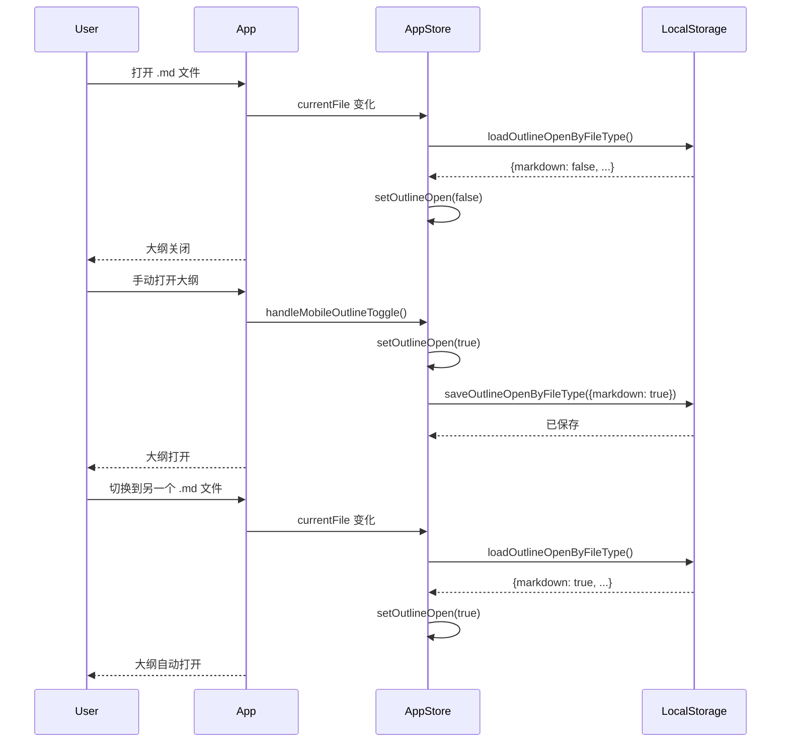

# Outline Memory by File Type - Design Document

**Date:** 2026-07-02  
**Feature:** 记忆大纲边栏打开状态，按文件类型区分

## Overview

实现大纲边栏打开状态的记忆功能，根据文件类型（markdown、html、other）分别记忆用户的偏好。当用户切换文件时，系统自动根据文件类型的记忆状态打开或关闭大纲边栏。

## Requirements

### 核心需求
1. 记忆大纲边栏的打开/关闭状态
2. 不分具体文档和项目（全局设置）
3. 分文件类型记忆（markdown、html、other）
4. 自动切换：切换文件时根据文件类型的记忆状态自动调整
5. 默认状态：首次打开新文件类型时默认关闭

### 文件类型分类
- **markdown**: `.md`, `.markdown` 文件
- **html**: `.html`, `.htm` 文件  
- **other**: 所有其他文件类型（图片、代码等）

### 用户体验
- 用户打开 `.md` 文件并手动打开大纲 → 下次打开任何 `.md` 文件时大纲自动打开
- 用户切换到 `.html` 文件 → 根据之前对 html 的偏好自动决定大纲状态
- 用户切换到图片文件 → 大纲自动关闭（other 类型默认 false）

## Design

### Data Structure

使用 localStorage 存储文件类型状态映射：

```typescript
interface OutlineOpenByFileType {
  markdown: boolean;
  html: boolean;
  other: boolean;
}
```

LocalStorage key: `outline-open-by-filetype`

Default values:
```typescript
const DEFAULT_OUTLINE_OPEN_STATE: OutlineOpenByFileType = {
  markdown: false,
  html: false,
  other: false
};
```

### Implementation Components

#### 1. Settings Utilities (`frontend/src/utils/settings.ts`)

**新增常量：**
```typescript
const OUTLINE_OPEN_BY_FILETYPE_KEY = 'outline-open-by-filetype';
```

**新增函数：**
```typescript
export const loadOutlineOpenByFileType = (): OutlineOpenByFileType => {
  try {
    const saved = localStorage.getItem(OUTLINE_OPEN_BY_FILETYPE_KEY);
    if (saved) {
      const parsed = JSON.parse(saved);
      return {
        markdown: parsed.markdown ?? false,
        html: parsed.html ?? false,
        other: parsed.other ?? false,
      };
    }
  } catch (e) {
    console.error('Failed to load outline open state by filetype:', e);
  }
  return DEFAULT_OUTLINE_OPEN_STATE;
};

export const saveOutlineOpenByFileType = (state: OutlineOpenByFileType): void => {
  try {
    localStorage.setItem(OUTLINE_OPEN_BY_FILETYPE_KEY, JSON.stringify(state));
  } catch (e) {
    console.error('Failed to save outline open state by filetype:', e);
  }
};
```

#### 2. App Store (`frontend/src/stores/appStore.ts`)

**新增信号：**
```typescript
const [outlineOpenByFileType, setOutlineOpenByFileType] = 
  createSignal<OutlineOpenByFileType>(loadOutlineOpenByFileType());
```

**新增方法：**
```typescript
getOutlineOpenForFileType(fileType: 'markdown' | 'html' | 'other'): boolean {
  return outlineOpenByFileType()[fileType];
},

setOutlineOpenForFileType(fileType: 'markdown' | 'html' | 'other', open: boolean): void {
  setOutlineOpenByFileType(prev => {
    const updated = { ...prev, [fileType]: open };
    saveOutlineOpenByFileType(updated);
    return updated;
  });
},
```

#### 3. File Type Detection

**文件类型判断函数：**
```typescript
function getFileTypeCategory(fileName: string): 'markdown' | 'html' | 'other' {
  const lowerName = fileName.toLowerCase();
  if (lowerName.endsWith('.md') || lowerName.endsWith('.markdown')) {
    return 'markdown';
  }
  if (lowerName.endsWith('.html') || lowerName.endsWith('.htm')) {
    return 'html';
  }
  return 'other';
}
```

#### 4. Auto-switch Logic

在 `frontend/src/App.tsx` 中添加 `createEffect`：

```typescript
createEffect(() => {
  const currentFile = fileStore.currentFile();
  const outlineOpen = appStore.outlineOpen();
  
  if (!currentFile) {
    // 无文件打开时，关闭大纲但不更新记忆
    if (outlineOpen) {
      appStore.setOutlineOpen(false);
    }
    return;
  }
  
  const fileTypeCategory = getFileTypeCategory(currentFile.fileName);
  const shouldBeOpen = appStore.getOutlineOpenForFileType(fileTypeCategory);
  
  // 仅在状态不一致时更新，避免循环
  if (shouldBeOpen !== outlineOpen) {
    appStore.setOutlineOpen(shouldBeOpen);
  }
});
```

#### 5. User Toggle Handler

修改 `frontend/src/hooks/useLayout.ts` 中的 `handleMobileOutlineToggle`：

```typescript
const handleMobileOutlineToggle = () => {
  if (appStore.isMobile()) {
    mobileLayoutStore.toggleRightDrawer();
  } else {
    const currentFile = fileStore.currentFile();
    if (!currentFile) return;
    
    const fileTypeCategory = getFileTypeCategory(currentFile.fileName);
    const newState = !appStore.outlineOpen();
    
    // 更新大纲状态和记忆
    appStore.setOutlineOpen(newState);
    appStore.setOutlineOpenForFileType(fileTypeCategory, newState);
  }
};
```

## Data Flow



## Edge Cases

### 1. 首次打开文件（无历史）
- LocalStorage 无数据或解析失败 → 返回默认值
- 大纲默认关闭（false）

### 2. 文件类型不支持大纲
- fileTypeCategory 为 'other'
- 状态为 false → 大纲自动关闭

### 3. 关闭最后一个项目
- currentFile 变为 null
- 大纲关闭，但不更新记忆状态（避免污染 other 类型）

### 4. 清除 LocalStorage
- 所有文件类型恢复默认（false）
- 用户需要重新建立偏好，但功能正常

### 5. 防止循环触发
- createEffect 中检查 `shouldBeOpen !== outlineOpen`
- 仅在状态不一致时更新，避免无限循环

## Testing

### Unit Tests

1. **settings.test.ts**
   - `loadOutlineOpenByFileType()` - 正常加载、空值、解析错误
   - `saveOutlineOpenByFileType()` - 正常保存、异常处理

2. **appStore.test.ts**
   - `getOutlineOpenForFileType()` - 各文件类型状态读取
   - `setOutlineOpenForFileType()` - 状态更新和持久化

3. **手动测试场景**
   - 打开 .md 文件 → 大纲关闭 → 手动打开 → 切换 .md → 自动打开
   - 打开 .html 文件 → 大纲关闭 → 切换 .md → 自动打开
   - 切换到图片 → 大纲自动关闭
   - 切换回 .md → 大纲恢复打开

### Integration Tests

验证完整流程：
- LocalStorage 读写正确
- 状态持久化在浏览器重启后仍然有效
- 多个文件切换时状态正确切换

## Implementation Order

1. **settings.ts** - 添加存储函数和常量
2. **appStore.ts** - 添加状态信号和方法
3. **App.tsx** - 添加自动切换效果
4. **useLayout.ts** - 修改用户切换逻辑
5. 运行现有测试，确保无破坏
6. 添加新的单元测试
7. 手动测试验证

## Future Considerations

### 潜在扩展
- 如果未来支持更多文件类型的大纲（如 LaTeX），只需扩展 fileType 分类
- 如果需要用户系统，可以将此设置迁移到后端 Settings 系统

### 性能优化
- LocalStorage 读写频率低（仅在切换文件时），无需优化
- createEffect 仅在 currentFile 变化时触发，性能开销小

## Risks

1. **LocalStorage 清除** - 用户清除浏览器数据会丢失偏好，但这是预期行为
2. **浏览器兼容性** - LocalStorage 在所有现代浏览器中支持良好
3. **状态同步** - 防止循环触发已通过条件检查解决

## Success Criteria

✅ 用户打开 .md 文件并手动打开大纲后，下次打开 .md 文件大纲自动打开  
✅ 用户切换到不同文件类型时，大纲状态根据记忆自动调整  
✅ 首次打开新文件类型时，大纲默认关闭  
✅ 状态持久化在浏览器重启后仍然有效  
✅ 不影响现有功能（大纲宽度调整、手动切换等）